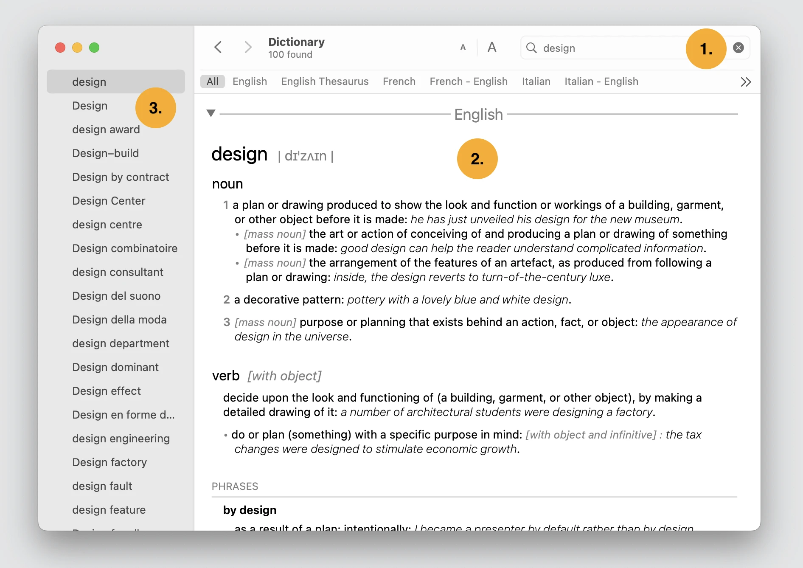
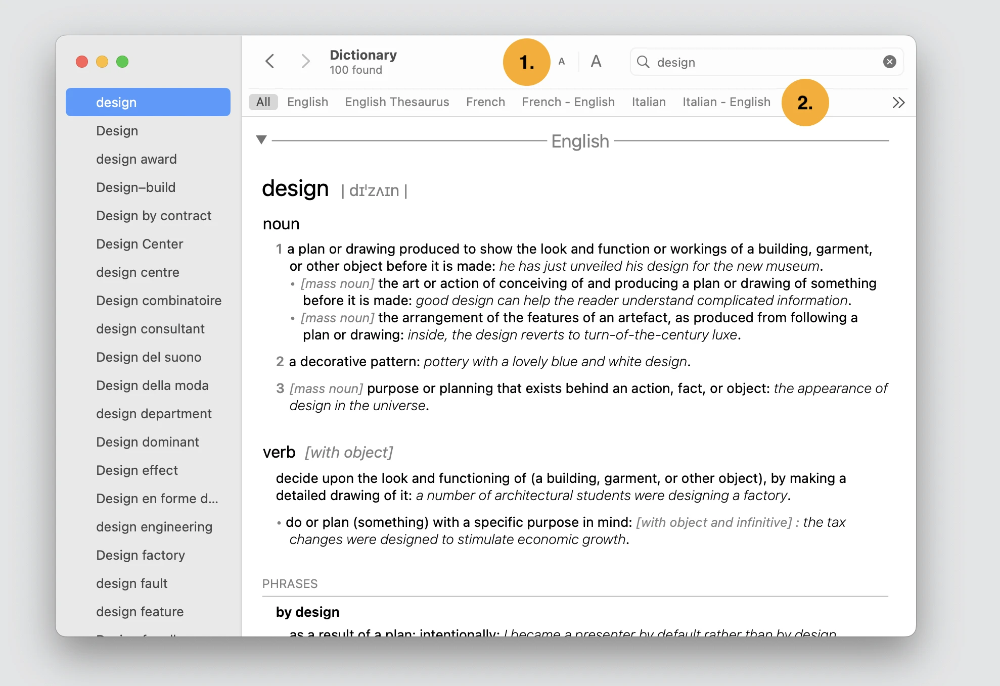

import videoRecording from '../../images/posts/apples-dictionary-app/dictionary-app-intro.mp4';

<video controls muted >
  <source src={videoRecording} type="video/mp4" />
  

    Your browser doesn't support HTML video.
  

</video>

Other dictionaries let you type and view a list of words, select one word from the list to view it’s description. If you want to see other words from the list, you need to return to the search field to see the list. Apple’s dictionary app took a different approach.

Let’s imagine you want to look up the word “design” in the English dictionary.

1. You start entering the word “design” into the search field
2. The first word with description instantly appears in the middle of the screen. Depending on your entry, this might be what you were looking for.
3. If not, on the left side you have an option to browse other words.

I find this interaction flow very easy and simple.

They added few more features:

1. If you have problem with your vision, you can adjust the font size.
2. If the word is in the other dictionary, there are tabs to quickly switch dictionary.

Apart from these features you can view the number of words found, I was wondering if that is really necessary. Maybe it is important for some users who want to know how many occurrences this word has in a given dictionary. Anyways, I hope you also found this design inspirational.
